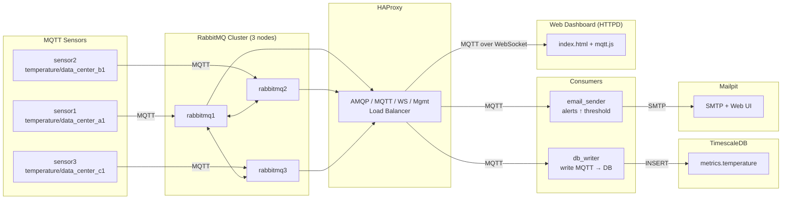

# Микросервисное приложение (обработка IoT)

Этот проект демонстрирует работу распределённого кластера RabbitMQ, балансировку через HAProxy, эмуляцию MQTT-сенсоров, запись данных во временные ряды TimescaleDB, отправку email-уведомлений и отображение данных в простом дашборде.

---

## Архитектура проекта



---

## Состав системы

### RabbitMQ Cluster (3 узла)

* Отказоустойчивый кластер RabbitMQ.
* Узлы 2 и 3 автоматически присоединяются к первому.
* Каждый узел хранит данные в отдельном volume.

### HAProxy

Балансирует:

* AMQP — 5672
* Management UI — 15672
* Web MQTT — 15675
* MQTT — 1883

### MQTT-сенсоры

Три контейнера эмулируют работу датчиков в дата центрах и публикуют данные о температуре раз в 60 секунд.

### Email Sender + Mailpit

* Подписывается на `temperature/#`.
* Отправляет email при превышении температуры выше 25°C.
* Mailpit работает как отладочный SMTP + UI.

### TimescaleDB + DB Writer

* Хранит данные сенсоров во временных рядах.
* `db_writer` сохраняет MQTT-сообщения в таблицу `temperature`.

### Dashboard (HTTPd)

Показывает в текущие данные через MQTT WebSocket.

---

## Дерево проекта

```
project/
├── db_writer
│   ├── db_writer.py
│   └── Dockerfile
├── docker-compose.yaml
├── email_sender
│   ├── Dockerfile
│   └── mqtt_email_alert.py
├── haproxy
│   └── haproxy.cfg
├── httpd
│   ├── Dockerfile
│   └── site
│       ├── index.html
│       └── mqtt.js
├── rabbitmq
│   ├── cluster-entrypoint.sh
│   ├── Dockerfile
│   └── rabbitmq.conf
├── README.md
└── sensor
    ├── Dockerfile
    └── publish_mqtt.py
```

---

## Запуск

```bash
docker-compose up --build
```

---

## Проверка работы

### 1. Дашборд

Открыть в браузере (ждать около 10 секунд до появления данных):
[http://localhost:8080/](http://localhost:8080/)

---

### 2. Почтовые уведомления (Mailpit)

Открыть в браузере:
[http://localhost:8025/](http://localhost:8025/)

---

### 3. Проверка записей в TimescaleDB

```bash
docker run --rm -it --network project_default postgres \
  psql -h timescaledb -U postgres -d metrics
```

Пароль: `postgres`

SQL-запрос:

```sql
SELECT * FROM temperature ORDER BY time DESC LIMIT 10;
```

---

### 4. Имитация отказа датчика

```bash
docker stop project-sensor3-1
```
Ждать 2 минуты и проверить дашборд в браузере:
[http://localhost:8080/](http://localhost:8080/)

---

### 5. Имитация отказа узла RabbitMQ

```bash
docker stop rabbitmq2
```
Ждать 2 минуты и проверить дашборд в браузере:
[http://localhost:8080/](http://localhost:8080/)

---

## Остановка
Ctrl + C

```bash
docker-compose down -v
```
